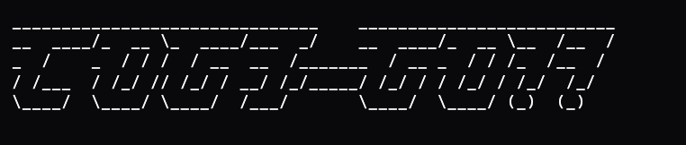

# COGI-GO!! The Cogito NTNU Web Backend

Backend for [Cogito-NTNU](https://cogito-ntnu.no)

<br />

---

NB: Any pushes to main will update the current website at the url!
If you wish upon any changes, either make a branch or contact Simon Sandvik Lee on Slack!

---

## Table of Contents

- [Introduction](#introduction)
- [Getting Started](#getting-started)
  - [Prerequisites](#prerequisites)
  - [Installation](#installation)
- [Usage](#usage)
- [Technologies Used](#technologies-used)
- [Contributors](#contributors)
- [License](#license)

## Introduction

The COGITO NTNU backend is written in GO using Gin and other frameworks.

## Getting Started

### Prerequisites

Before you begin, ensure you have the following installed on your machine:

- [Golang](https://go.dev/)

### Installation

1. Clone the repository:

```bash
git clone https://github.com/CogitoNTNU/cogi-go.git
```

1. Change into the directory

```bash
cd cogi-go
```

## Usage

To start the development server, run:

```bash
make cogigo-dev
make migrate
```

### Configuration

To setup email sending, you need to populate the environmental variables in the .example.env file.

```
SMTP_HOST=
SMTP_PORT=
SMTP_USER=
SMTP_PASSWORD=
SMTP_ENCRYPTION=
```

`SMTP_ENCRYPTION` is an ENUM that follows:
0 - No encryption
1 - DEPRECATED: Only SSL
2 - DEPRECATED: Only TLS
3 - SSLTLS
4 - STARTTLS

## Technologies Used

This project leverages the following technologies:

- TODO

## Contributors

<table align="center">
  <tr>
      <td align="center">
        <a href="https://github.com/sandviklee">
            <br />
            <sub><b>Simon Sandvik Lee</b></sub>
        </a>
    </td>
    <td align="center">
        <a href="https://github.com/A1ice-Z">
            <br />
            <sub><b>Simon Sandvik Lee</b></sub>
        </a>
    </td>
  </tr>
</table>

## License

This project is licensed under the [MIT License](https://opensource.org/license/mit/).

The MIT License is a permissive open-source license that allows you to use, modify, and distribute the code in both open source and proprietary projects. Make sure to review the full text of the license for a comprehensive understanding of your rights and responsibilities.
